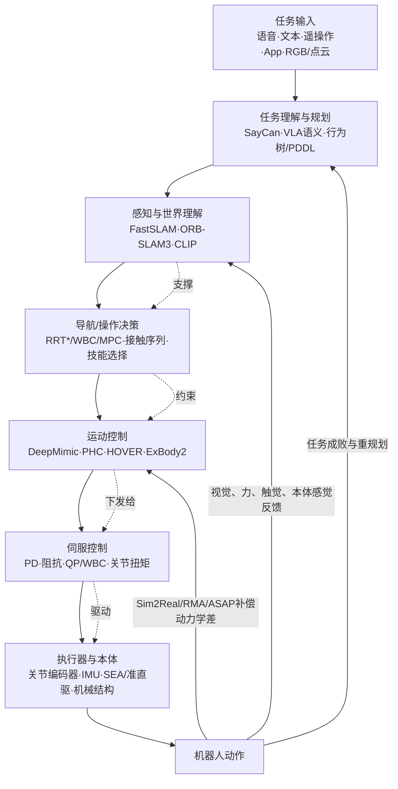

> 对于初学者，总感觉应该搭建起一个完整的思维框架；机器人是怎样从零件到像人一样行走起来？在这个文件里将会更全局地概括。  
> 另外，前文所说那么多论文，之间有没有关联呢？肯定是有的，它们都是机器人“跑通”“跑得更稳”中的基石。

# 关于0系列的解释补充

##  先辨清框架：机器人的八层不是八条并列赛道，而是一条带反馈的依赖链

任务输入首先变成可验证的意图，意图变成对环境、物体和自身状态都有依据的计划；计划再变成导航或操作决策；决策被连续化为轨迹与技能；轨迹经模型预测、全身控制或学习策略变成关节/末端参考；伺服层把它变成电流、扭矩或位置命令；执行器与本体最终产生运动；力、视觉、编码器与 IMU 再校正上层所有假设。 因此，八层应理解为“上层规定做什么和大致怎么做，中层维持可行性与稳定性，下层兑现物理动作，反馈再决定上层要不要重想”。

仓库当前结构则偏另一条工程主线。其 10 个编号文件从仿真基础、动作模仿、全身控制、人→机、操作、VLA、Sim2Real、数据到工具，层层推进；README 又把内容归为身体层、控制层、智能层，并推荐 AMASS/SMPL、PHC/UHC、ExBody/OmniH2O/HOVER、HumanPlus/TeleVision、VLA/π0/GR00T 等学习路线。 这条路线非常适合快速进入“人形全身动作如何生成、采集与落地”，但尚不能回答一些底座问题：机器人如何获得连续、可信的自我状态？轨迹怎样保证无碰撞和动力学可行？力矩如何闭环？电机延迟、背隙、摩擦和柔顺性怎样进入策略？这些不是装饰性知识，而是上层学习失败时通常最先失效的环节；但是由于确实过于基础，所以只浅尝辄止。

##  总关系图：学习不是线性替代，而是上层语义逐渐嵌入既有闭环

*图 1：八层链条与四条反馈回路。数据来源：依据仓库框架 [2] 与候选论文的接口和贡献归纳 [3][4][5][6][7][8]。*

图中最重要的不是自上而下箭头，而是三条反向回路。感知反馈更新世界状态，使导航和操作不必一次性猜对；任务反馈根据失败、人类示教或语义模型重新分解目标；动力学反馈通过系统辨识、域随机化、在线适应或 delta action 修正仿真训练与真机之间的不匹配。仓库的 07_sim_to_real、02_motion_imitation、03_whole_body_control 之所以应被理解为同一条链，而非三个热门主题，正是因为前两者产生的策略必须通过第三条回路接受真实执行条件的检验。[1][7][8]

**学习方法的演化是“接口不变、内部实现变化”，而不是“上层吃掉底层”。** 例如 DeepMimic 仍需要物理仿真、参考动作、奖励和策略执行；PHC 把参考动作扩展到万级人体动作并增加失败恢复；ExBody2 再增加机器人可行性过滤和教师—学生蒸馏。[9][10][11] 这是在同一“参考动作→物理策略”接口上的能力扩展，而不是否定动力学。同理，RT-2、OpenVLA、π0 把语言/视觉映射到动作，但在真机机器人中仍须连接到底层轨迹、WBC、PD 或关节控制器。[12][13][14][15]

## 逐层映射：仓库现有方法在哪里，补什么，为什么在那里

###  任务输入与任务理解：仓库已有语言—动作接口，应先补“可执行性检查”

| 层级 | 仓库已有内容 | 补充工作 | 年份 | 为何放在这里 | 承继/互补关系 |
|---|---|---|---:|---|---|
| 任务输入 | 语音/文本/App/遥操作；VLA、π0、GR00T 入口 | CLIP | 2021 | 提供语言—视觉对齐，便于把文本任务锚定到视觉对象 | 为 VLA 提供语义表示，不解决可执行性 |
| 任务理解与规划 | RT-1/RT-2、OpenVLA、π0、GR00T | SayCan | 2022 | 把 LLM 提议与机器人已有技能、当前状态和可行性结合 | 与仓库 VLA 互补，避免把大模型直接当闭环控制器 |
| 任务分解 | VLA 任务条件、语言指令 | PDDL/行为树（建议做最小工程样例，非论文） | — | 生成可验证子目标、失败恢复与安全检查 | 与 LLM 规划互补，适合高风险工业场景 |

仓库 06_vla 已把 RT-1/RT-2、OpenVLA、π0、GR00T 纳入语言条件策略，但没有显式区分“语义选择下一个技能”与“保证技能可在当前世界执行”。SayCan 的意义正在于它用机器人已有低层技能及其价值函数约束语言模型，使“会描述任务”不等于“能落地”。[3] 对入门者，合理的实现顺序是：先让语言模型输出有限技能库中的步骤，再让每一步附带前置条件、目标区域、允许力/速度、失败处理；只有在不满足前置条件时才重新规划。这样可以复用仓库 VLA，同时把安全性从模型权重移到系统接口。

**语言模型应成为可调用规划器之一，不应成为唯一闭环控制器。** RT-2 的关键是把动作作为 token 共训练，把互联网视觉—语言知识迁移到机器人控制；OpenVLA 则用 970k 条真实演示训练开放 7B 模型；π0 以预训练 VLM 为基础、用流匹配生成连续动作。[12][13][14][15] 三者是同一“语言—视觉—动作”角色的演化，但它们的输入仍来自相机、本体感觉和任务描述，输出仍需进入受频率、执行器、碰撞和接触约束包裹的下游。

###  感知与世界理解：仓库有 3D 操作表征，应先补状态估计而不是只加视觉模型

| 层级 | 仓库已有内容 | 补充工作 | 年份 | 为何放在这里 | 承继/互补关系 |
|---|---|---|---:|---|---|
| 概率状态估计 | RGB/RGB-D/点云操作数据 | FastSLAM | 2002 | 把运动模型、观测和地图估计写成概率递推 | 后续滤波、因子图、图优化与视觉 SLAM 的基础 |
| 视觉—惯性状态估计 | 操作感知、3D 表征 | ORB-SLAM3 | 2021 | 相机/IMU/多地图闭环，输出位姿、地图与重定位 | 对导航、重规划和真机数据时间戳提供底座 |
| 视觉—语言语义 | CLIP、VLA | CLIP | 2021 | 将语言条件连接到图像/点云观测 | 与几何 SLAM 互补，不替代六自由度状态估计 |
| 操作表征 | DP3、RDT-1B | 3D Diffusion Policy | 2024 | 用稀疏点云得到空间坐标和抓取几何 | 比纯 2D 策略更接近操作控制，但仍依赖传感器标定 |

仓库 05_manipulation 已覆盖 ACT、Diffusion Policy、DP3、RDT-1B，8_datasets 也提供了 OmniH2O-6、Open X-Embodiment、LeRobot 等数据资源。[1] 这里的补充分配不是因为 SLAM 更新，而是因为“看见杯子”与“知道机器人基座位姿、杯子位姿协方差、自身是否打滑”不是同一件事。FastSLAM 把 SLAM 分解为机器人路径与条件独立的路标估计，并用 Rao–Blackwellized 粒子滤波实现；它解释了机器人为什么必须同时估计自身与地图，而不是把每一帧检测结果当真值。[5] ORB-SLAM3 把视觉、视觉—惯性和多地图 SLAM 统一到 MAP 估计，并能跨时间复用关键帧和回环校正。[6]

**几何状态与语义感知必须并行，不能用其一替代另一。** 对操作任务，DP3 的紧凑 3D 点云表征使策略对空间、视角、外观和实例变化更鲁棒；其真机任务在仅 40 条演示下达到 85% 成功率，说明 3D 结构本身降低了样本复杂度。[16] 但这不意味着可以省略相机标定、手眼关系、物体跟踪和接触状态。最佳实践是：SLAM/状态估计输出机器人位姿及不确定度，目标检测/分割/3D 表征输出物体关系，任务规划再决定抓取、移动和放置。

###  导航/操作决策：仓库有技能级学习，应先补可行性、碰撞与接触约束

| 层级 | 仓库已有内容 | 补充工作 | 年份 | 为何放在这里 | 承继/互补关系 |
|---|---|---|---:|---|---|
| 全局/局部规划 | LocoMuJoCo、轨迹基准、MPC 工具 | RRT* | 2011 | 为冗余高维空间提供渐近最优采样规划 | PRM/RRT 的能力证明，是运动规划理论基线 |
| 接触与任务序列 | WBC、TRILL、CLocoMani | Dynamic Movement Primitives（建议作为技能基元） | 2006/2013 综述体系 | 将轨迹表示为稳定动力系统，便于门控、组合和复现 | 与模仿学习和强化学习互补 |
| 移动操作 | HOVER、TRILL、wb_humanoid_mpc | SayCan、行为树/PDDL | 2022/工程 | 把“去哪里、拿什么、何时换技能”与几何规划耦合 | 与仓库全身控制器形成上下层接口 |
| 操作动作分布 | ACT、Diffusion Policy、DP3、RDT-1B | Diffusion Policy | 2023 | 从视觉条件生成多峰、时序动作块 | 替代单步回归策略，并与动作分块、3D 表征互补 |

RRT* 的意义是形式化采样规划从“能找到解”到“样本足够时收敛到最优解”，其计算复杂度与普通概率完备 RRT 只差常数倍。[4] 它适合作为导航、机械臂构型空间、接触序列和轨迹优化的前端。仓库中的 wb_humanoid_mpc 已经出现质心/MPC 与全身优化思路；这是正确方向，但应明确它仍是“决策层到运动控制层”的桥梁，而非底层伺服本身。[1]

**规划层给学习策略提供的不是旧替代方案，而是约束和失败原因。** 在静态环境中，RRT* 可输出无碰撞路径；MPC 在有限时域内预测状态并持续滚动求解；WBC 再分配多接触力与任务优先级。学习方法可从这些信号中模仿，也可以把规划结果作为奖励、课程或安全过滤。反过来，当感知突变、路径不可行或接触失败时，学习策略应触发重新规划，而不是盲目执行已学到的动作块。

###  运动控制：这是仓库最强的一段，应从“模仿动作”推进到“在真实约束下可执行的全身动作”

| 层级 | 仓库已有内容 | 核心论文/系统 | 年份 | 贡献与所处位置 | 与其他工作的关系 |
|---|---|---|---:|---|---|
| 参考动作+RL | DeepMimic 基线 | DeepMimic | 2018 | 用动作片段定义风格，以 RL 在物理仿真中学会跟随并处理扰动/恢复 | 仓库 PHC、UHC、BeyondMimic 的共同范式源头 |
| 大规模动作跟随 | PHC/UHC | PHC | 2023 | 从单段跟踪扩展到约万级动作，PMCP、噪声姿态输入与失败恢复 | 承继 DeepMimic，把“能否一直演”变为“能否持续控制” |
| 通用接口 | HOVER | HOVER | 2024 | 神经全身控制器提供可复用的全身控制接口 | 是 ExBody/OmniH2O/TRILL 等上层策略的底座候选 |
| 表达与稳定折中 | ExBody/ExBody2 | ExBody2 | 2025 | 用教师生成可行数据、学生用本体感觉控制，并过滤不可行全身动作 | 承继重定向与 PHC，回应人形上半身表达和下半身稳定冲突 |
| 人→机器人数据 | HumanPlus、OmniH2O、TeleVision | OmniH2O | 2025 | 以运动学姿态为通用接口，融合 VR/语言/RGB，并用特权教师蒸馏 | 与 HumanPlus 互补，把遥操作直接变成自主数据 |
| Transformer 策略 | 高阶策略/动作历史 | Learning Humanoid Locomotion over Challenging Terrain | 2024 | 用本体感觉历史预测下一步动作，先在平地预训练、再在崎岖地形强化学习 | 与 RMA/ASAP 互补：前者改善时序策略，后两者解决动力学差 |

仓库 02_motion_imitation 已正确指出 DeepMimic 的奠基地位：参考动作 + 物理仿真 + RL。[9] DeepMimic 能处理关键帧、动作捕捉翻转和重定向动作，并把模仿目标与用户目标结合，覆盖人形、Atlas 类机器人等多类角色。[9] PHC 则解决“动作库变大后如何持续、稳定地模仿”：其官网明确报告在清理后的 AMASS 11,313 条序列上达到 98.9% 成功率，并支持从视频或语言姿态实时控制。[10] 这不是简单增加数据量，而是把动作先验从一段 clip 升级为可组合、可持续执行的技能库。

**ExBody2 的本质是“机器人可行性过滤器”，不是更炫的扩散动作生成器。** 它把全身速度跟踪与关键点跟踪解耦，用教师生成更符合机器人运动学和动力学的中间数据，再蒸馏给只使用本体感觉历史的学生，部署于 Unitree G1。[11] 因此它与 PHC 的关系是：PHC 强化“参考动作如何被持续模仿”，ExBody2 强化“哪些人类动作值得模仿、如何在表达性与稳定间取舍”。对初学者，先理解 DeepMimic→PHC→ExBody2，再理解 BeyondMimic 的全身追踪与扩散扩展，比直接读所有仓库项目页更有收获。

**HOVER、HumanPlus、OmniH2O 分别代表底座、自主技能和数据闭环三种承继。** HOVER 提供神经全身控制器，适合作为人形策略通用接口；HumanPlus 先以 40 小时人体动作在仿真训练低层策略，再由 RGB 影子控制真机采集数据，最后用自我中心视觉行为克隆；OmniH2O 则以运动学姿态统一 VR、语言和 RGB 输入，通过教师蒸馏与真机数据得到自主技能，并发布 OmniH2O-6 六类日常任务数据。[17][18] 三者都承认“人体数据不等于机器人可执行数据”，只是分别把解决重点放在控制器接口、低成本真机采集和全身接口上。

### 伺服控制、执行器与本体：仓库最弱，也是“策略好但机器人站不稳”的首要嫌疑层

| 层级 | 仓库已有/相邻内容 | 补充工作 | 年份 | 核心贡献 | 补入理由 |
|---|---|---|---:|---|---|
| 计算力矩/QP/WBC | HOVER、ExBody2、wb_humanoid_mpc | Drake | 2019 起持续维护 | 暴露动力学、接触、优化梯度的模型基设计与验证工具 | 给出全身控制、MPC、接触和轨迹优化的共同理论接口 |
| 阻抗与力交互 | TRILL、FALCON、接触操作 | MIT Cheetah 3 | 2018/2019 | 高带宽本体感觉执行器 + 模块化平衡/步态控制 | 说明执行器带宽与力控决定接触策略设计 |
| 伺服回路 | MuJoCo、仿真训练 | PD/QP/WBC 最小专题 | — | 关节位置/速度/力矩闭环、摩擦补偿、延迟与扭矩限幅 | 补齐 001 明确列出但仓库缺少的层 |
| 物理仿真 | MuJoCo、Isaac Lab、Genesis | MuJoCo | 2012 体系 | 以连续时间约束和接触优化支持最优控制、系统辨识 | 与 Isaac Lab 的 GPU 并行训练互补，非替代 |

仓库 01_sim_basics 讨论了 MuJoCo、Isaac Lab、Genesis、SAPIEN/ManiSkill，但没有把仿真器、接触模型、控制频率和真实关节动力学区分开。[19] 补充 Drake 不是为了再装一个仿真器，而是获得可检查的动力学、优化和反馈控制接口。MIT Cheetah 3 论文则把高带宽本体感觉执行器、腿部机械范围和控制架构连接起来：机器人可在无外部感知时通过反应式步态修改处理未知扰动，并能盲爬楼梯。[20] 这条证据直接支持一个反直觉判断：人形全身表现不仅是网络问题，也是机械透明度和执行器是否能如实实现命令的问题。

**伺服层应以“误差—扭矩—安全”而非“关节角度”来理解。** 建议在仓库新增 013_servo_and_actuators.md，最小实验为 1–2 个关节或小型双足/机械臂：读取编码器位置、速度、电流/估计扭矩；实现位置 PD、速度前馈、扭矩饱和、积分抗饱和、死区/摩擦补偿和软件限幅；用 chirp/sine 做系统辨识；再比较理想仿真、延迟仿真与真机的跟踪误差。此实验完成后，再读 RMA、ASAP 和 wb_humanoid_mpc 会更有依据。

### 学习闭环：仓库已覆盖主要入口，但应把模仿、RL、适应和真机反馈画成四个不同环

| 闭环 | 仓库代表 | 补充关键论文 | 年份 | 解决的问题 | 不应误读为 |
|---|---|---|---:|---|---|
| 模仿学习 | DeepMimic、PHC、ACT、ALOHA | DeepMimic | 2018 | 从动作片段/示教学习状态到动作的策略 | 不等于无模型直接 Sim2Real |
| 真机强化学习 | 学习走路 | Learning to Walk in the Real World | 2021 | 自动数据收集与安全约束下真机学习 | 不否定仿真，提供另一学习通道 |
| 在线适应 | DR、RMA | RMA | 2021 | 基策略 + 适应模块，在真机快速编码地形/负载/磨损 | 不是离线系统辨识的完整替代 |
| 动力学对齐 | ASAP | ASAP | 2025 | 仿真跟踪预训练后，以真机轨迹训练残差 action 并对齐 | 不保证任何硬件差异都可补偿 |
| 遥操作到自主 | HumanPlus、OmniH2O、TeleVision | Open-TeleVision | 2024 | 立体主动视觉和双臂/手部镜像，采集长程数据 | 不等于远程操作本身就是自主智能 |

Learning to Walk in the Real World 在 Minitaur 的平地、软床垫和有裂缝门垫上，用多任务学习和安全约束 RL 自动学习行走；其会议实际出版年为 2021 年，内容却常被标作 2020 CoRL。[21] RMA 则由基策略与适应模块构成，仅用仿真训练即可在 A1 真机上零样本适应岩石、湿滑、可变形等不同地形。[7] 它与 Hwangbo 2019 的“学习执行器模型 + Sim2Real”是互补路线：后者修正个体物理差异，前者在线编码未知环境并快速响应。[8][7]

**ASAP 把“补偿差在哪里”提升为可学习的残差动作。** 它先在仿真用重定向人体动作预训练运动跟踪，再部署到真机收集数据，训练 delta action 模型；随后把该模型放回仿真，微调原策略以贴合真机动力学。论文已在 Unitree G1 上验证 IsaacGym→IsaacSim、IsaacGym→Genesis 与仿真→真机三种迁移。[22] 这意味着仓库 07_sim_to_real 不应只列“随机化、微调、NeRF/3DGS”等工程词汇，而应至少把系统辨识、域随机化、RMA、执行器网络、真实轨迹微调、ASAP 组织成从低层到高层的方法递进。

##  时间—依赖图：新方法建立在新接口上，而非把旧方法清零

| 时间 | 论文/系统 | 所在层 | 与仓库主线对应的关系 |
|---:|---|---|---|
| 2002 | FastSLAM | 感知与世界理解 | 为后续概率定位、建图和主动感知提供基础 |
| 2011 | RRT* | 导航/操作决策 | 让仓库的“轨迹/技能”具有渐近最优规划依据 |
| 2018 | DeepMimic | 运动控制 | 仓库动作模仿链条的范式起点 |
| 2019 | Learning Agile and Dynamic Motor Skills（ANYmal） | Sim2Real + 运动控制 | 用学习执行器模型建立真机敏捷策略 |
| 2021 | ORB-SLAM3 | 感知与世界理解 | 补足视觉—惯性—多地图闭环 |
| 2021 | RMA | 学习闭环/适应 | 与 ASAP 共同解释在线适应如何补仿真差 |
| 2022 | SayCan | 任务理解与规划 | 限制 LLM 必须落到可执行技能 |
| 2023 | PHC | 运动控制 | 仓库人体动作—人形控制主链承继 DeepMimic |
| 2023 | Diffusion Policy | 操作策略 | 仓库操作学习的重要动作分布范式 |
| 2023 | RT-2 | 任务理解→策略 | VLA 从互联网知识到动作 token 的代表作 |
| 2024 | π0 | VLA/动作生成 | 用 VLM + 流匹配输出连续动作，支持零样本和后训练 |
| 2024 | Open-TeleVision | 人→机数据 | 为仓库遥操作数据闭环提供沉浸采集方法 |
| 2024 | Learning Humanoid Locomotion over Challenging Terrain | 运动控制/策略 | Transformer 用历史本体感觉处理延迟和未知状态 |
| 2024 | 3D Diffusion Policy | 操作策略 | 把 3D 结构补入扩散动作策略 |
| 2025 | ExBody2 | 全身控制 | 解决表达性与稳定/可行性的冲突 |
| 2025 | OmniH2O | 人→机/自主/Sim2Real | 以姿态接口统一遥控、语言、RGB 和真机学习 |
| 2025 | ASAP | Sim2Real | 用真机 delta action 对齐仿真动力学 |

这张表不能当作“阅读顺序”。推荐阅读顺序应先读 FastSLAM、RRT*、伺服/PD/WBC 小实验，再读 DeepMimic→PHC→ExBody2；随后按问题读 SayCan/RT-2→ACT/Diffusion Policy→DP3→OpenVLA/π0；最后读 RMA、ASAP 和真机遥操作。这样阅读路径始终从“机器人必须维持的状态”向上，而不是从最流行的模型名称向下。

**演化的主线是把更多不确定性从手工规则移入可学习策略，但不取消约束。** 传统方法手工设计状态估计、地图、路径、轨迹、力矩分配和伺服增益；学习方法用模仿、RL、扩散、Transformer 或 VLA 学习其中一层或数层；Sim2Real 方法再学习仿真与真机的剩余差异。后一层永远不能自动证明前一层可以删除，尤其当系统进入安全、接触和高速动态场景时。

##  承继、互补、替代关系表：避免把仓库中的“并列项目”误读为重复工作

| 关系 | 代表对 | 判断 | 说明 |
|---|---|---|---|
| 承继 | DeepMimic → PHC | 强承继 | 都通过奖励让物理策略跟踪参考动作；PHC 增加规模、持续性与恢复 |
| 承继 | PHC → ExBody2 | 部分承继、部分重构 | 都使用重定向人体动作；ExBody2 增加机器人可行性筛选和蒸馏 |
| 互补 | HOVER ↔ ExBody2 | 接口互补 | HOVER 提供通用神经全身控制接口，ExBody2 强调表达性跟踪和部署 |
| 互补 | HumanPlus ↔ OmniH2O | 数据闭环互补 | 前者强调 RGB 影子与行为克隆，后者强调多输入全身接口和 OmniH2O-6 |
| 替代 | ACT ↔ Diffusion Policy | 同一“策略表示”层内的部分替代 | 都以时序动作建模替代单步回归；前者用动作块 CVAE，后者用扩散去噪 |
| 互补 | DP3 ↔ RDT-1B | 3D 与基础模型互补 | 前者强化紧凑 3D 表征，后者强调跨机器人双臂动作空间和 1.2B 参数预训练 |
| 互补 | RT-2 ↔ OpenVLA | 开放与闭源生态互补 | 两者都证明跨任务视觉—语言—动作迁移，OpenVLA 提供开放后训练和评测基础 |
| 互补 | π0 ↔ 传统控制 | 上下层互补 | VLA/流匹配负责语义和技能动作，WBC/伺服仍负责动态可行执行 |
| 互补 | RMA ↔ ASAP | 适应策略互补 | RMA 在线编码环境，ASAP 学习残差动作并反向修正仿真策略 |
| 互补 | MuJoCo ↔ Isaac Lab | 用途互补 | MuJoCo 强调模型优化/接触解析，Isaac Lab 强调 GPU 并行学习与合成感知 |

这张关系表的边界很重要。ACT 与 Diffusion Policy 都在操作策略层竞争，但都可与 3D 表征、VLA、WBC 组合；HOVER、HumanPlus、OmniH2O 都在人形控制层，但分别强调底座、低成本采集和统一接口。把“同层”写成“重复”，会把论文的接口创新误判掉。

**仓库项目页容易混在一起的地方是“代码仓库、论文、数据集、训练框架”。** 例如 PHC、ExBody2、OmniH2O 都有仓库，但应分别记录论文、项目页、代码、模型/数据四个链接；GR00T 在 06_vla 中是 NVIDIA 的具身基础模型生态，不能直接当作已经由第三方同行评审并逐字可引用的单篇论文。补充材料也应避免把所有 NVIDIA 技术博客、arXiv 预印本和正式会议论文混在同一可信度等级。

## 仓库缺口优先级：先补“会失效的底座”，再补更大的模型

**第一优先是伺服与本体。** 001 明确列有该层，而现有文件主要讨论仿真器、RL 框架、数据格式和真机 SDK，缺少对关节带宽、扭矩环、编码器、IMU、SEA/准直驱、背隙、延迟、摩擦和通信周期的分析。MIT Cheetah 3 已表明高带宽本体感觉执行器和模块化控制架构可以让机器人在无外部感知时响应扰动；因此建议新文件从单关节系统辨识和 PD/QP 控制实验开始，而不是一上来复现全身 RL。[20]

**第二优先是状态估计和传感器时间。** 现有 VLA/操作数据内容很强，但若图像时间戳、机器人基座位姿、相机外参、手眼标定和动作时间戳不能对齐，策略会把历史、延迟和观测噪声错误地学成“动作规律”。建议把 ORB-SLAM3、IMU 预积分、外参标定和 ros2_control 状态接口各做成最小可运行示例。[6]

**第三优先是接触、全身动力学与实时软件。** 建议在 Drake 上做浮动基动力学、接触力锥、QP 全身控制、MPC 与仿真硬件闭环；再回到 MuJoCo/Isaac Lab 做大规模并行学习。这样能区分“优化解不出可行动作”和“神经网络学不会可行动作”两种失败。

**第四优先是任务规划的可执行性。** SayCan 与行为树/PDDL 的轻量工程示例，应约束 VLA 输出有限技能、前置条件、目标帧和安全限制。[3] 这不是削弱大模型，而是把它从高延迟、不可验证的全闭环控制器变成可在约束下调用的高级规划组件。

**不建议把大量普通大模型综述补进核心目录。** 它们可以帮助理解语言模型或视觉基础模型，但若没有机器人状态、动作接口、真实硬件闭环和失败分析，就不应与 DeepMimic、RMA、ASAP、ACT、π0 等并列。仓库 06_vla 可以新增一篇“VLA 与传统机器人闭环边界”的子文档，专门讲输入/输出空间、动作 tokenizer、频率、安全壳和失败回退。

## 这是推荐的实验闭环（完整链）：用六个小项目把八层串起来

| 阶段 | 项目 | 覆盖层 | 成功判据 | 主要失败诊断 |
|---|---|---|---|---|
| 1 | 两轮/单关节 PD 调参 | 伺服—执行器 | 阶跃响应无持续振荡，延迟可测 | 增益、摩擦、电流饱和、采样抖动 |
| 2 | 机械臂视觉抓取 | 感知—决策—控制 | 标定误差、抓取成功率和重规划可记录 | 手眼标定、点云噪声、夹具力 |
| 3 | 网格地图 + A*/RRT* + 局部避障 | 感知—导航—控制 | 无碰撞、重规划、里程漂移可显示 | 状态估计、地图过期、动力学约束 |
| 4 | MuJoCo 单技能模仿 | 模仿—运动控制—Sim2Real | 奖励、跟踪误差、扰动恢复可复现 | 参考动作不可行、接触参数错误 |
| 5 | G1/双足低层行走 + RMA/ASAP | 全身控制—执行器—适应 | 不同负载/摩擦下的真机恢复 | 执行器模型、延迟、系统辨识 |
| 6 | VLA/ACT 上位策略 + 安全壳 | 任务—操作—控制 | 不可执行指令被拒绝，任务失败可回退 | 动作频率、数据分布、闭环延迟 |

这一路线刻意不要求初学者一开始复现人形大模型。阶段 1–3 建立对真实物理和频率的敬畏；阶段 4 让动作模仿具有明确的物理奖励；阶段 5 才进入仓库最强的人形全身控制；阶段 6 把 VLA 接入已有安全接口。这样学习曲线与证据链一致。

## 引用来源

[1] https://github.com/Y2KKKKK/robics_learning/tree/main
> “Name … 001_overall_viewpoint.md … 01_sim_basics.md … 02_motion_imitation.md … 03_whole_body_control.md … 04_human_to_robot.md … 05_manipulation.md … 06_vla.md … 07_sim_to_real.md … 08_datasets.md … 09_tools.md … README.md”

[2] https://github.com/Y2KKKKK/robics_learning/blob/main/001_overall_viewpoint.md
> “机器人系统的本质，是感知 — 决策 — 控制 — 执行 — 反馈的闭环。”

[3] https://say-can.github.io/
> “We propose to provide this grounding by means of pretrained behaviors, which are used to condition the model to propose natural language actions that are both feasible and contextually appropriate.”

[4] https://dl.acm.org/doi/abs/10.1177/0278364911406761
> “The main contribution of this paper is the introduction of new algorithms, namely, PRM* and RRT*, which are provably asymptotically optimal.”

[5] https://www.aaai.org/Papers/AAAI/2002/AAAI02-089.pdf
> “FastSLAM decomposes the SLAM problem into a robot localization problem, and a collection of landmark estimation problems that are conditioned on the robot pose estimate.”

[6] https://ar5iv.labs.arxiv.org/html/2007.11898
> “This paper presents ORB-SLAM3, the first system able to perform visual, visual-inertial and multi-map SLAM with monocular, stereo and RGB-D cameras.”

[7] https://arxiv.org/abs/2107.04034?source=post_page-----154d3315cb50-------------------------------------
> “RMA consists of two components: a base policy and an adaptation module. The combination of these components enables the robot to adapt to novel situations in fractions of a second.”

[8] http://stke.sciencemag.org/doi/pdf/10.1126/scirobotics.aau5872
> “The approach is applied to the ANYmal robot … Using policies trained in simulation, the quadrupedal machine achieves locomotion skills that go beyond what had been achieved with prior methods.”

[9] https://xbpeng.github.io/projects/DeepMimic/index.html
> “We show that well-known reinforcement learning (RL) methods can be adapted to learn robust control policies capable of imitating a broad range of example motion clips.”

[10] https://github.com/ZhengyiLuo/PHC
> “We present a physics-based humanoid controller that achieves high-fidelity motion imitation and fault-tolerant behavior in the presence of noisy input.”

[11] https://github.com/jimazeyu/exbody2
> “Exbody2 … producing whole-body tracking controllers that are trained on both human motion capture and simulated data and then transferred to the real world.”

[12] https://proceedings.mlr.press/v229/zitkovich23a.html
> “We propose to co-fine-tune state-of-the-art vision-language models on both robotic trajectory data and Internet-scale vision-language tasks.”

[13] https://openvla.github.io/
> “OpenVLA, a 7B-parameter open-source VLA trained on a diverse collection of 970k real-world robot demonstrations.”

[14] https://arxiv.org/abs/2410.24164
> “We propose a novel flow matching architecture built on top of a pre-trained vision-language model (VLM) to inherit Internet-scale semantic knowledge.”

[15] https://developer.nvidia.com/isaac/lab?ref=startup.africa
> “NVIDIA Isaac Lab is an open-source, GPU-accelerated, agent-ready simulation framework for robot learning designed to train robot policies at scale.”

[16] https://www.arxiv.org/abs/2403.3954
> “DP3 successfully handles most tasks with just 10 demonstrations and surpasses baselines with a 24.2% relative improvement.”

[17] https://humanoid-ai.github.io/
> “We first train a low-level policy in simulation via reinforcement learning using existing 40-hour human motion datasets. This policy transfers to the real world.”

[18] https://proceedings.mlr.press/v270/he25b.html
> “Using kinematic pose as a universal control interface, OmniH2O enables various ways for a human to control a full-sized humanoid with dexterous hands.”

[19] https://github.com/Y2KKKKK/robics_learning/blob/main/01_sim_basics.md
> “MuJoCo 成为首选……Isaac Lab……训练速度比 MuJoCo 快几个量级……Genesis……SAPIEN / ManiSkill。”

[20] https://hdl.handle.net/1721.1/126619
> “high-bandwidth proprioceptive actuators to manage physical interaction with the environment.”

[21] https://proceedings.mlr.press/v155/ha21c.html
> “The key difficulties for on-robot learning systems are automatic data collection and safety.”

[22] https://www.arxiv.org/abs/2502.01143
> “we deploy the policies in the real world and collect real-world data to train a delta (residual) action model that compensates for the dynamics mismatch.”
